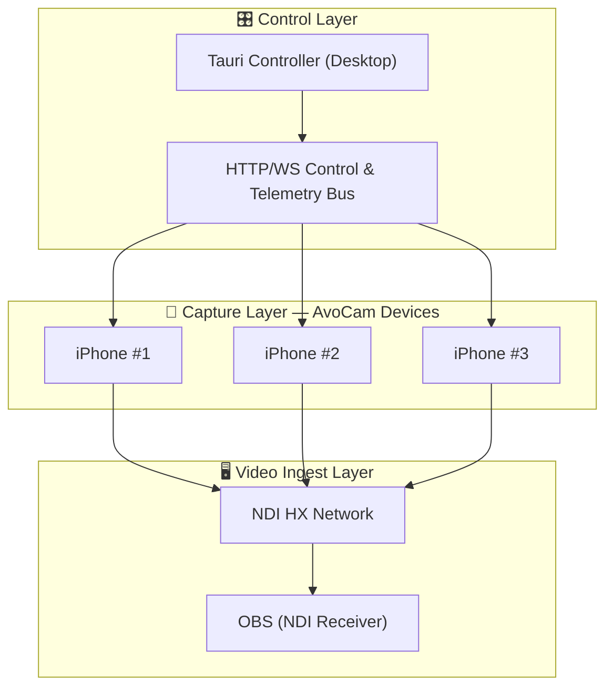

# AVOLO-CAM

Multi-iPhone NDI streaming system for OBS with desktop remote control.

## Overview

AVOLO-CAM enables multiple iPhones to stream high-quality, low-latency video to OBS via NDI|HX, controlled from a single desktop application. Perfect for multi-camera productions, live events, and professional streaming setups.

**Key Features:**
- 📱 Multiple iPhone cameras streaming NDI to OBS
- 🎛 Desktop controller for unified management
- 🔄 Real-time telemetry (FPS, bitrate, battery, temperature)
- 👥 Group control for batch operations
- 📡 Automatic camera discovery via mDNS
- 🎨 Full range color pipeline (NV12)
- 💡 Tally support with torch feedback
- ⚡ Low latency streaming

## Architecture


```mermaid
flowchart TB

%% ---------------- LAYERS ----------------
subgraph Layer1["🎛 Control Layer"]
  Tauri["Tauri Controller (Desktop)"]
  CBus["HTTP/WS Control & Telemetry Bus"]
  Tauri --> CBus
end

subgraph Layer2["📱 Capture Layer — AvoCam Devices"]
  direction LR
  P1["iPhone #1"]
  P2["iPhone #2"]
  P3["iPhone #3"]
end

subgraph Layer3["🖥 Video Ingest Layer"]
  VBus["NDI HX Network"]
  OBS["OBS (NDI Receiver)"]
  VBus --> OBS
end

%% ----------- FAN-OUT / FAN-IN -----------
CBus --> P1
CBus --> P2
CBus --> P3

P1 --> VBus
P2 --> VBus
P3 --> VBus

```

## Components

### 1. iOS App ([ios-app/](ios-app/))

Swift iOS application for iPhone cameras.

**Features:**
- AVFoundation video capture (720p to 4K, 24-60fps)
- NDI|HX streaming (encoding handled by NDI SDK)
- Full camera controls: white balance, ISO, shutter, focus, zoom
- Multiple lens support (wide, ultra-wide, telephoto)
- HTTP REST API for control (Bearer token auth)
- WebSocket telemetry (1Hz updates)
- Embedded web UI for standalone control
- Bonjour/mDNS advertisement
- Tally support with torch feedback (program/preview)
- Thermal state monitoring

[→ iOS App README](ios-app/README.md)

### 2. Tauri Controller ([tauri-controller/](tauri-controller/))

Rust + Svelte desktop application for multi-camera control.

**Features:**
- mDNS camera discovery
- Grid view with real-time telemetry
- Group control (start/stop/settings for multiple cameras)
- Bounded concurrency (Semaphore-based parallelism)
- WebSocket telemetry subscriptions
- Manual camera addition (fallback for restricted networks)
- Profile management

[→ Tauri Controller README](tauri-controller/README.md)

### 3. OBS Integration

Standard NDI Source plugin (no custom development required).

**Configuration:**
- Install NDI Plugin for OBS
- Project settings: Rec.709, Full range (recommended)
- Add NDI Source, select "AVOLO-CAM-<alias>"

## Quick Start

### Prerequisites

- **iOS Development**: macOS with Xcode 15+, iOS 15+ iPhones
- **Desktop App**: Rust 1.70+, Node.js 18+
- **OBS**: OBS Studio with NDI Plugin
- **Network**: All devices on same WiFi (with multicast support)

### Setup

1. **iOS App**:
   ```bash
   cd ios-app
   # Follow ios-app/README.md to create Xcode project
   # Integrate NDI SDK
   # Build and deploy to iPhones
   ```

2. **Tauri Controller**:
   ```bash
   cd tauri-controller
   npm install
   npm run tauri:dev
   ```

3. **OBS**:
   - Install NDI Plugin
   - Configure project: Rec.709 / Full
   - Add NDI sources

### Usage

1. Launch AvoCam on iPhones (same WiFi network)
2. Launch Tauri Controller on desktop
3. Cameras appear automatically (or add manually)
4. Click "▶️ Start" to begin streaming
5. Add NDI sources to OBS scenes

## Technical Specifications

### Video Pipeline

- **Capture**: AVFoundation, 720p-4K @ 24-60fps
- **Pixel format**: NV12 full range (`kCVPixelFormatType_420YpCbCr8BiPlanarFullRange`)
- **Encoding**: Handled internally by NDI SDK (no separate VideoToolbox encoder)
- **Transmission**: NDI|HX protocol
- **Color**: sRGB color space, full range
- **Latency**: ≤150ms glass-to-glass target

```
AVCaptureSession → CMSampleBuffer → CVPixelBuffer → NDI SDK → Network
```

### API (iOS → Controller)

- **REST**: HTTP on port 8888 (configurable)
- **Auth**: Bearer token (generated per camera)
- **WebSocket**: `ws://<ip>:8888/ws` for telemetry (1Hz)
- **Discovery**: mDNS `_avolocam._tcp.local.`

**Endpoints:**
- `GET /api/v1/status` - Current status + telemetry + capabilities
- `GET /api/v1/capabilities` - Supported formats (per-lens)
- `POST /api/v1/stream/start` - Start NDI stream
- `POST /api/v1/stream/stop` - Stop NDI stream
- `POST /api/v1/camera` - Adjust settings (WB, ISO, shutter, focus, zoom)
- `POST /api/v1/camera/wb/measure` - Measure white balance from scene
- `PUT /api/v1/settings/alias` - Update camera alias
- `GET /api/v1/torch/level` / `PUT /api/v1/torch/level` - Torch control

**WebSocket Telemetry:**
```json
{
  "fps": 29.97,
  "bitrate": 9800000,
  "battery": 0.78,
  "temp_c": 38.4,
  "wifi_rssi": -55,
  "ndi_state": "streaming",
  "dropped_frames": 0,
  "charging_state": "unplugged",
  "cpu_usage": 0.45,
  "ndi_connections": 1
}
```

### Group Control

- **Bounded Concurrency**: Max 10 parallel operations (tokio::Semaphore)
- **Atomic Fan-out**: All selected cameras receive command
- **Per-camera Results**: Individual success/failure reporting
- **Target Latency**: <250ms for batch operations

## Documentation

- **[CLAUDE.md](CLAUDE.md)** - Architecture and implementation guidance
- **[docs/specs.md](docs/specs.md)** - Complete project specifications
- **[docs/LOT-A-CHECKLIST.md](docs/LOT-A-CHECKLIST.md)** - Detailed task breakdown
- **[docs/TODO.md](docs/TODO.md)** - Current tasks and roadmap
- **[ios-app/README.md](ios-app/README.md)** - iOS app setup
- **[tauri-controller/README.md](tauri-controller/README.md)** - Desktop controller setup

## Troubleshooting

### mDNS Discovery Issues

- **Cameras not appearing**: Check network allows multicast, not on guest VLAN
- **Firewall**: Allow port 5353 UDP
- **Fallback**: Use manual camera addition in controller

### Streaming Issues

- **High latency**: Check WiFi signal strength, reduce resolution/framerate
- **Frame drops**: Check network congestion, verify WiFi 5GHz band
- **Color mismatch**: Verify OBS project is Rec.709 / Full
- **Thermal throttling**: Lower resolution/fps, improve iPhone ventilation

### API Issues

- **401 Unauthorized**: Check Bearer token matches
- **Timeout**: Verify iPhone is on network, check firewall
- **Rate limit 429**: Slow down camera settings updates (50ms min interval)

## Contributing

This is an internal project. For development:

1. Check [docs/TODO.md](docs/TODO.md) for current tasks
2. Read architecture in [CLAUDE.md](CLAUDE.md)
3. Follow code style in existing files
4. Test on physical devices before committing

## License

Internal use only. NDI SDK license applies to NDI components.

## Resources

- [NDI SDK](https://ndi.tv/sdk/)
- [Tauri Documentation](https://tauri.app/)
- [AVFoundation Guide](https://developer.apple.com/documentation/avfoundation)
- [SwiftNIO](https://github.com/apple/swift-nio)

## Support

For questions and issues:
- Review inline code comments (especially NDIManager and NetworkServer)
- Check [CLAUDE.md](CLAUDE.md) for architectural guidance
- See component READMEs for specific setup instructions

---

**Target**: Professional multi-camera NDI streaming system with desktop control
