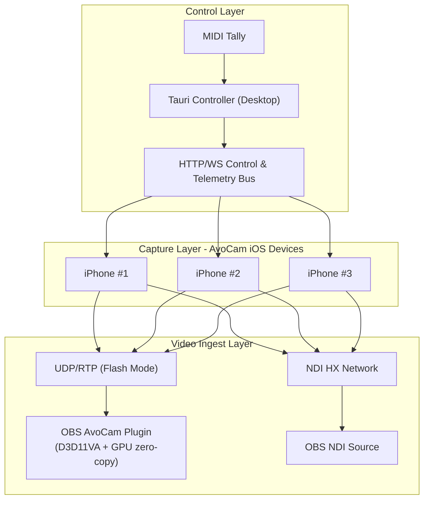

# AVOLO-CAM

Multi-iPhone streaming system for OBS with desktop remote control.

## Overview

AVOLO-CAM enables multiple iPhones to stream high-quality, low-latency video to OBS, controlled from a single desktop application. The system supports three streaming modes: NDI|HX for standard use, Flash Mode for ultra-low latency (~40-80ms), and SRT for resilient transport over unreliable networks.

**Key Features:**
- Multiple iPhone cameras streaming to OBS simultaneously
- **Flash Mode**: ultra-low latency streaming via UDP/RTP with GPU zero-copy decoding
- NDI|HX and SRT streaming modes
- Custom OBS plugin with D3D11VA hardware decoding and GPU-resident pipeline
- Desktop controller with real-time telemetry and group control
- Automatic camera discovery via mDNS
- Full camera controls: white balance, ISO, shutter, focus, zoom, lens selection
- MIDI tally support
- Thermal management with automatic bitrate step-down

## Architecture


```mermaid
flowchart TB

subgraph Layer1["Control Layer"]
  Tauri["Tauri Controller (Desktop)"]
  MIDI["MIDI Tally"]
  CBus["HTTP/WS Control & Telemetry Bus"]
  Tauri --> CBus
  MIDI --> Tauri
end

subgraph Layer2["Capture Layer - AvoCam iOS Devices"]
  direction LR
  P1["iPhone #1"]
  P2["iPhone #2"]
  P3["iPhone #3"]
end

subgraph Layer3["Video Ingest Layer"]
  direction TB
  NDIBus["NDI HX Network"]
  FlashBus["UDP/RTP (Flash Mode)"]
  OBSPlugin["OBS AvoCam Plugin\n(D3D11VA + GPU zero-copy)"]
  OBSNDI["OBS NDI Source"]
  NDIBus --> OBSNDI
  FlashBus --> OBSPlugin
end

CBus --> P1
CBus --> P2
CBus --> P3

P1 --> NDIBus
P1 --> FlashBus
P2 --> NDIBus
P2 --> FlashBus
P3 --> NDIBus
P3 --> FlashBus
```

## Components

### 1. iOS App ([ios-app/](ios-app/))

Swift iOS application for iPhone cameras.

**Features:**
- AVFoundation video capture (720p to 4K, 24-60fps)
- Three streaming modes:
  - **NDI|HX** - Standard NDI streaming (encoding via NDI SDK)
  - **Flash Mode** - Ultra-low latency H.264 over UDP/RTP (RFC 6184)
  - **SRT** - Secure Reliable Transport with MPEG-TS muxing
- Hardware H.264 encoding via VideoToolbox (CBR, no B-frames, low-latency profile)
- Full camera controls: white balance, ISO, shutter speed, focus, zoom
- Multiple lens support (wide, ultra-wide, telephoto)
- HTTP REST API + WebSocket telemetry (SwiftNIO)
- Bonjour/mDNS advertisement with dynamic TXT records
- Tally support with torch feedback (program/preview)
- Thermal state monitoring with automatic bitrate step-down
- Embedded web UI for standalone control

[More details in ios-app/README.md](ios-app/README.md)

### 2. OBS AvoCam Plugin ([obs-avolocam-plugin/](obs-avolocam-plugin/))

Custom C++ OBS plugin that receives H.264 video from iOS devices via UDP/RTP and decodes it with hardware acceleration.

**Pipeline:**
```
UDP/RTP -> Jitter Buffer -> RTP Depacketizer -> AU Assembler -> Sync State Machine -> Decoder -> OBS
```

**Features:**
- **GPU zero-copy path (Windows):** FFmpeg D3D11VA decode -> NV12 shared texture -> compute shader NV12-to-RGBA conversion -> shared texture to OBS render thread
- **CPU fallback path:** Frame copy via `obs_source_output_video()`
- Two latency modes:
  - **Flash (ultra-low):** Jitter buffer bypass, 1-frame decode queue, 5ms UDP timeout, ~40-80ms glass-to-glass
  - **Stable:** 16-50ms jitter buffer, 4-6 frame decode queue, ~120-150ms glass-to-glass
- Async decode thread decoupled from receive and render
- Sync state machine with automatic IDR request on packet loss
- WebSocket client for telemetry and auto-port switching
- mDNS camera discovery (Bonjour on Windows, Avahi on Linux)
- Platform decoders: FFmpeg D3D11VA, Media Foundation, VideoToolbox, FFmpeg software fallback

**GPU Pipeline Detail (Windows):**

The decoder runs on its own D3D11 device (separate from OBS) to avoid lock contention. Decoded NV12 textures are converted to RGBA via a DirectCompute shader, then shared with the OBS render thread through DXGI shared handles with a 4-entry texture cache.

[Build instructions in obs-avolocam-plugin/BUILD-WINDOWS.md](obs-avolocam-plugin/BUILD-WINDOWS.md)

### 3. Tauri Controller ([tauri-controller/](tauri-controller/))

Rust + Svelte desktop application for multi-camera control.

**Features:**
- mDNS camera discovery + manual IP entry
- Grid view with real-time telemetry (FPS, bitrate, battery, temperature, WiFi RSSI)
- Group control with bounded concurrency (tokio Semaphore)
- WebSocket telemetry subscriptions
- MIDI tally integration
- Profile management
- Per-camera settings and batch operations

[More details in tauri-controller/README.md](tauri-controller/README.md)

## Quick Start

### Prerequisites

- **iOS Development**: macOS with Xcode 15+, iOS 15+ iPhones
- **Desktop Controller**: Rust 1.70+, Node.js 18+
- **OBS Plugin (Windows)**: MSVC, CMake 3.16+, OBS SDK, FFmpeg D3D11VA headers/libs
- **Network**: All devices on same WiFi (with multicast support for mDNS)

### Setup

1. **iOS App**:
   ```bash
   cd ios-app
   # Follow ios-app/README.md for Xcode project setup
   # Integrate NDI SDK, SwiftNIO, SwiftSRT
   # Build and deploy to iPhones
   ```

2. **Tauri Controller**:
   ```bash
   cd tauri-controller
   npm install
   npm run tauri:dev
   ```

3. **OBS Plugin** (Windows):
   ```bash
   cd obs-avolocam-plugin
   cmake -B build -DCMAKE_BUILD_TYPE=Release
   cmake --build build --config Release
   # DLL is installed to %APPDATA%/obs-studio/plugins/obs-avolocam/bin/64bit
   ```

### Build All

```bash
make build        # Build iOS + Tauri
make build-ios    # Build iOS Ad Hoc IPA only
make build-tauri  # Build Tauri desktop app only
make clean        # Clean all build artifacts
```

### Usage

1. Launch AvoCam on iPhones (same WiFi network)
2. Launch Tauri Controller on desktop
3. Cameras appear automatically via mDNS (or add manually)
4. Select streaming mode (NDI, Flash, or SRT)
5. Start streaming
6. In OBS:
   - **NDI mode**: Add NDI Source, select "AVOLO-CAM-\<alias\>"
   - **Flash mode**: Add AvoCam Source, cameras are discovered automatically

## Streaming Modes

### NDI|HX (Standard)

Standard NDI streaming. Encoding handled by the NDI SDK. Works with the standard OBS NDI plugin. Good balance of quality and compatibility.

### Flash Mode (Ultra-Low Latency)

Custom UDP/RTP pipeline optimized for minimal latency:

| Stage | Latency |
|-------|---------|
| Network + jitter | 5-20ms |
| Jitter buffer | 0-8ms (bypass mode) |
| H.264 decode (D3D11VA) | 5-15ms |
| GPU convert (NV12 to RGBA) | 1-2ms |
| Render thread polling | 0-16ms |
| **Total** | **~40-80ms** |

- iOS encodes H.264 via VideoToolbox, packetizes as RTP (RFC 6184), sends over UDP
- OBS plugin receives, depacketizes, assembles access units, decodes on GPU
- 1-frame decode queue with replace-in-place semantics
- Automatic IDR request on sync loss via WebSocket

### SRT (Resilient Transport)

Secure Reliable Transport with MPEG-TS muxing. Suitable for unreliable networks with configurable latency and optional encryption.

## Technical Specifications

### iOS Video Pipeline

```
AVCaptureSession -> VideoToolbox H.264 -> [NDI SDK | RTP/UDP | SRT/TS] -> Network
```

- **Pixel format**: NV12 full range (`kCVPixelFormatType_420YpCbCr8BiPlanarFullRange`)
- **Color**: Rec.709, full range end-to-end
- **H.264 encoding**: CBR, High 4.2, no B-frames, GOP=fps, real-time mode
- **Default bitrate**: 10 Mbps (configurable 8-12 Mbps)

### OBS Plugin Decode Pipeline (Flash Mode)

```
UDP recv -> Jitter Buffer -> RTP Depack -> AU Assembler -> Sync FSM -> D3D11VA Decode -> GPU Convert -> OBS Render
```

- **Decoder**: FFmpeg D3D11VA (own D3D11 device, separate from OBS)
- **GPU conversion**: DirectCompute shader, BT.709 full range NV12 to RGBA
- **Texture sharing**: DXGI shared handles with 4-entry LRU cache
- **Threading**: Receive thread, decode thread, OBS render callbacks
- **Frame buffer**: Double-buffered with atomic swap (lock-free)

### API (iOS -> Controller)

- **REST**: HTTP on port 8888
- **Auth**: Bearer token
- **WebSocket**: `ws://<ip>:8888/ws` for telemetry (1Hz)
- **Discovery**: mDNS `_avolocam._tcp.local.`

**Key Endpoints:**
- `GET /api/v1/status` - Status + telemetry + capabilities
- `GET /api/v1/capabilities` - Supported formats per lens
- `POST /api/v1/stream/start` - Start streaming (mode: ndi/flash/srt)
- `POST /api/v1/stream/stop` - Stop streaming
- `POST /api/v1/camera` - Camera settings (WB, ISO, shutter, focus, zoom)
- `POST /api/v1/encoder/force_keyframe` - Force IDR frame

**WebSocket Telemetry (1Hz):**
```json
{
  "fps": 29.97,
  "bitrate": 9800000,
  "battery": 0.78,
  "temp_c": 38.4,
  "wifi_rssi": -55,
  "ndi_state": "streaming",
  "dropped_frames": 0,
  "charging_state": "unplugged",
  "cpu_usage": 0.45,
  "ndi_connections": 1
}
```

## Documentation

- **[CLAUDE.md](CLAUDE.md)** - Architecture and implementation guidance
- **[docs/specs.md](docs/specs.md)** - Complete project specifications
- **[docs/flash-mode.md](docs/flash-mode.md)** - Flash mode implementation details
- **[docs/PERFORMANCE_OPTIMIZATIONS.md](docs/PERFORMANCE_OPTIMIZATIONS.md)** - Performance optimization guide
- **[docs/LOT-A-CHECKLIST.md](docs/LOT-A-CHECKLIST.md)** - Lot A task breakdown
- **[docs/TODO.md](docs/TODO.md)** - Current tasks and roadmap
- **[obs-avolocam-plugin/BUILD-WINDOWS.md](obs-avolocam-plugin/BUILD-WINDOWS.md)** - OBS plugin build instructions
- **[ios-app/README.md](ios-app/README.md)** - iOS app setup
- **[tauri-controller/README.md](tauri-controller/README.md)** - Desktop controller setup

## Troubleshooting

### mDNS Discovery Issues

- **Cameras not appearing**: Check multicast is allowed on the network, not on guest VLAN
- **Firewall**: Allow port 5353 UDP
- **Fallback**: Use manual camera addition in controller

### Flash Mode Issues

- **High latency**: Check WiFi signal strength, ensure 5GHz band, reduce resolution
- **Glitches/artifacts**: WiFi jitter causing packet loss; switch to Stable mode or improve network
- **No video**: Verify UDP port is not blocked by firewall, check WebSocket connection for port negotiation
- **Sync loss**: Plugin requests IDR automatically; persistent issues indicate network problems

### NDI Streaming Issues

- **High latency**: Check WiFi signal, reduce resolution/framerate
- **Frame drops**: Network congestion, verify 5GHz WiFi band
- **Color mismatch**: Verify OBS project is Rec.709 / Full

### API Issues

- **401 Unauthorized**: Check Bearer token matches
- **Timeout**: Verify iPhone is on network, check firewall
- **Rate limit 429**: Slow down camera settings updates (50ms min interval)

## Tech Stack

| Component | Technologies |
|-----------|-------------|
| **iOS App** | Swift, AVFoundation, VideoToolbox, NDI SDK, SwiftNIO, Network.framework, Bonjour |
| **OBS Plugin** | C++17, FFmpeg D3D11VA, DirectCompute, Media Foundation, Bonjour SDK |
| **Controller** | Tauri 2 (Rust + Svelte), Tokio, mdns-sd, midir |

## Contributing

This is an internal project. For development:

1. Check [docs/TODO.md](docs/TODO.md) for current tasks
2. Read architecture in [CLAUDE.md](CLAUDE.md)
3. Follow code style in existing files
4. Test on physical devices before committing

## License

This project is licensed under the [GNU General Public License v2.0](LICENSE). See [LICENSE](LICENSE) for details.

NDI SDK license applies separately to NDI components.
