# AVOLO-CAM

Multi-iPhone NDI streaming system for OBS with desktop remote control.

## Overview

AVOLO-CAM enables multiple iPhones to stream high-quality, low-latency video to OBS via NDI|HX, controlled from a single desktop application. Perfect for multi-camera productions, live events, and professional streaming setups.

**Key Features:**
- 📱 Multiple iPhone cameras streaming NDI to OBS
- 🎛 Desktop controller for unified management
- 🔄 Real-time telemetry (FPS, bitrate, battery, temperature)
- 👥 Group control for batch operations
- 📡 Automatic camera discovery via mDNS
- 🎨 Rec.709 Full color pipeline end-to-end
- ⚡ Low latency (≤150ms glass-to-glass target)

## Project Status

✅ **LOT A - MCP Core**: Structure and architecture complete
- iOS app structure with all core managers implemented
- Tauri controller with mDNS discovery and group control
- Full API contracts defined
- Ready for NDI SDK integration and testing

📝 **Next Steps**:
1. Complete Xcode project creation
2. Integrate NDI SDK for iOS
3. Implement SwiftNIO HTTP/WebSocket server
4. Test with physical iPhones and OBS
5. Measure and optimize latency

## Architecture

```mermaid
flowchart TB

%% ---------------- LAYERS ----------------
subgraph Layer1["🎛 Control Layer"]
  Tauri["Tauri Controller (Desktop)"]
  CBus["HTTP/WS Control & Telemetry Bus"]
  Tauri --> CBus
end

subgraph Layer2["📱 Capture Layer — AvoCam Devices"]
  direction LR
  P1["iPhone #1"]
  P2["iPhone #2"]
  P3["iPhone #3"]
end

subgraph Layer3["🖥 Video Ingest Layer"]
  VBus["NDI HX Network"]
  OBS["OBS (NDI Receiver)"]
  VBus --> OBS
end

%% ----------- FAN-OUT / FAN-IN -----------
CBus --> P1
CBus --> P2
CBus --> P3

P1 --> VBus
P2 --> VBus
P3 --> VBus

```



## Components

### 1. iOS App ([ios-app/](ios-app/))

Swift iOS application for iPhone cameras.

**Features:**
- AVFoundation video capture (1080p30 baseline, up to 4K)
- VideoToolbox H.264 encoding (low-latency, no B-frames, GOP=fps)
- NDI|HX transmission with metadata
- HTTP REST API for control (Bearer token auth)
- WebSocket telemetry (1Hz updates)
- Embedded web UI for standalone control
- Bonjour/mDNS advertisement
- Thermal management with auto bitrate adjustment

**Status:** 🚧 Core structure complete, needs Xcode project + NDI SDK integration

[→ iOS App README](ios-app/README.md)

### 2. Tauri Controller ([tauri-controller/](tauri-controller/))

Rust + Svelte desktop application for multi-camera control.

**Features:**
- mDNS camera discovery
- Grid view with real-time telemetry
- Group control (start/stop/settings for multiple cameras)
- Bounded concurrency (Semaphore-based parallelism)
- WebSocket telemetry subscriptions
- Manual camera addition (fallback for restricted networks)
- Profile management (LOT B)

**Status:** ✅ Fully implemented and ready for testing

[→ Tauri Controller README](tauri-controller/README.md)

### 3. OBS Integration

Standard NDI Source plugin (no custom development required).

**Configuration:**
- Install NDI Plugin for OBS
- Project settings: Rec.709, Full range
- Disable per-source rescale (use scene-level only)
- Add NDI Source, select "AVOLO-CAM-XX"

## Quick Start

### Prerequisites

- **iOS Development**: macOS with Xcode 15+, iOS 15+ iPhones
- **Desktop App**: Rust 1.70+, Node.js 18+
- **OBS**: OBS Studio with NDI Plugin
- **Network**: All devices on same WiFi (with multicast support)

### Setup

1. **iOS App**:
   ```bash
   cd ios-app
   # Follow ios-app/README.md to create Xcode project
   # Integrate NDI SDK
   # Build and deploy to iPhones
   ```

2. **Tauri Controller**:
   ```bash
   cd tauri-controller
   npm install
   npm run tauri:dev
   ```

3. **OBS**:
   - Install NDI Plugin
   - Configure project: Rec.709 / Full
   - Add NDI sources

### Usage

1. Launch AvoCam on iPhones (same WiFi network)
2. Launch Tauri Controller on desktop
3. Cameras appear automatically (or add manually)
4. Click "▶️ Start" to begin streaming
5. Add NDI sources to OBS scenes

## Technical Specifications

### Video Pipeline

- **Capture**: AVFoundation, 720p-4K @ 24-60fps
- **Encode**: VideoToolbox H.264, CBR, real-time, no B-frames
- **Bitrate**: 8-12 Mbps (configurable, thermal-aware)
- **Color**: Rec.709 Full Range end-to-end
- **Latency**: ≤150ms glass-to-glass target

### API (iOS → Controller)

- **REST**: HTTP on port 8888 (configurable)
- **Auth**: Bearer token (generated per camera)
- **WebSocket**: `ws://<ip>:8888/ws` for telemetry (1Hz)
- **Discovery**: mDNS `_avolocam._tcp.local.`

**Endpoints:**
- `GET /api/v1/status` - Current status + telemetry + capabilities
- `GET /api/v1/capabilities` - Supported formats (per-lens)
- `POST /api/v1/stream/start` - Start NDI stream
- `POST /api/v1/stream/stop` - Stop NDI stream
- `POST /api/v1/camera` - Adjust settings (WB, ISO, shutter, zoom)
- `POST /api/v1/encoder/force_keyframe` - Force IDR frame
- `GET /api/v1/logs.zip` - Download rotating logs

**WebSocket Telemetry:**
```json
{
  "fps": 29.97,
  "bitrate": 9800000,
  "queue_ms": 6,
  "battery": 0.78,
  "temp_c": 38.4,
  "wifi_rssi": -55,
  "ndi_state": "streaming",
  "dropped_frames": 0,
  "charging_state": "unplugged"
}
```

### Group Control

- **Bounded Concurrency**: Max 10 parallel operations (tokio::Semaphore)
- **Atomic Fan-out**: All selected cameras receive command
- **Per-camera Results**: Individual success/failure reporting
- **Target Latency**: <250ms for batch operations

## Acceptance Criteria (LOT A - MCP)

- [ ] **Multi-cam Streaming**: ≥3 iPhones streaming 1080p30 @ 8-12 Mbps
- [ ] **Stability**: ≥2 hours continuous, <1% frame drops
- [ ] **Latency**: Glass-to-glass ≤150ms median
- [ ] **Resolution Switch**: <3 seconds
- [ ] **Group Control Latency**: <250ms to all targets
- [ ] **Reconnect**: <2 seconds after network blip
- [ ] **Color Accuracy**: Rec.709 Full maintained end-to-end

## Development Roadmap

### LOT A - MCP Core (Current) ✅ Structure Complete

- iOS video pipeline with low-latency encoding
- NDI|HX transmission
- HTTP/WebSocket control API
- Tauri controller with mDNS discovery
- Group control with bounded concurrency
- Basic web UI (embedded in iOS)

**Remaining**: NDI SDK integration, SwiftNIO server implementation, device testing

### LOT B - Stability & Multi-Cam Hardening

- Reconnect logic (keep-alive, fast resume)
- Thermal guard with UI warnings
- Network quality indicators (RSSI)
- Settings profiles (save/recall/copy)
- Per-cam rename, tagging, groups
- Read-only monitoring mode

### LOT C - Image Quality & Ops

- Orientation lock, lens selection (ultra-wide/wide/tele)
- Anti-banding (50/60 Hz), WB presets (3200K/4300K/5600K)
- IDR on demand, optional B-frames toggle
- Test patterns (SMPTE bars, focus chart, 1kHz tone)
- On-device preview refinement

### LOT D - Diagnostics & Admin

- Diagnostics endpoint (dropped frames, queue depth, temp timeline)
- Rotating logs with downloadable zip
- Telemetry charts (sparklines)
- Config backup/restore (full fleet snapshot)
- Stealth mode (API only, no mDNS)

### LOT E - Polish & Extensions (Optional)

- Adaptive bitrate ladder (10→8→6 Mbps)
- NTP time-stamping, basic tally return
- Optional TLS (self-signed)
- Ethernet guidance (USB-C→RJ45)
- LUT pipeline / HDR→SDR

## Documentation

- **[CLAUDE.md](CLAUDE.md)** - Architecture and implementation guidance for AI assistants
- **[LOT-A-CHECKLIST.md](LOT-A-CHECKLIST.md)** - Detailed task breakdown (150+ items)
- **[docs/specs.md](docs/specs.md)** - Complete project specifications
- **[ios-app/README.md](ios-app/README.md)** - iOS app setup and development
- **[tauri-controller/README.md](tauri-controller/README.md)** - Desktop controller setup

## Testing

### Network Matrix

- Wi-Fi 6 single AP vs mesh
- PC on gigabit Ethernet
- 1080p30 @ 8/10/12 Mbps
- 3-6 camera configurations

### Validation Checklist

- [ ] mDNS discovery across WLAN↔LAN
- [ ] OBS NDI Source configuration (Rec.709 / Full)
- [ ] Latency measurement (LED clock method)
- [ ] Bitrate stability (<1% drops over 2h)
- [ ] Resolution switch speed (<3s)
- [ ] Group command latency (<250ms)
- [ ] Reconnect after AP blip (<2s)
- [ ] Thermal behavior monitoring
- [ ] Color accuracy validation

## Troubleshooting

### mDNS Discovery Issues

- **Cameras not appearing**: Check network allows multicast, not on guest VLAN
- **Firewall**: Allow port 5353 UDP
- **Fallback**: Use manual camera addition in controller

### Streaming Issues

- **High latency**: Check WiFi signal, verify GOP=fps and no B-frames
- **Frame drops**: Reduce bitrate, check network congestion
- **Color mismatch**: Verify OBS project is Rec.709 / Full
- **Thermal throttling**: Lower bitrate/fps, improve iPhone ventilation

### API Issues

- **401 Unauthorized**: Check Bearer token matches
- **Timeout**: Verify iPhone is on network, check firewall
- **Rate limit 429**: Slow down camera settings updates (50ms min interval)

## Contributing

This is an internal project. For development:

1. Check [LOT-A-CHECKLIST.md](LOT-A-CHECKLIST.md) for current tasks
2. Read architecture in [CLAUDE.md](CLAUDE.md)
3. Follow code style in existing files
4. Test on physical devices before committing

## License

Internal use only. NDI SDK license applies to NDI components.

## Resources

- [NDI SDK](https://ndi.tv/sdk/)
- [Tauri Documentation](https://tauri.app/)
- [AVFoundation Guide](https://developer.apple.com/documentation/avfoundation)
- [VideoToolbox Reference](https://developer.apple.com/documentation/videotoolbox)
- [SwiftNIO Examples](https://github.com/apple/swift-nio-examples)

## Support

For questions and issues:
- Review inline code comments (especially NDIManager and NetworkServer)
- Check [CLAUDE.md](CLAUDE.md) for architectural guidance
- See component READMEs for specific setup instructions

---

**Project Timeline**: 4-6 weeks for LOT A MCP completion

**Target**: Professional multi-camera NDI streaming system with desktop control
