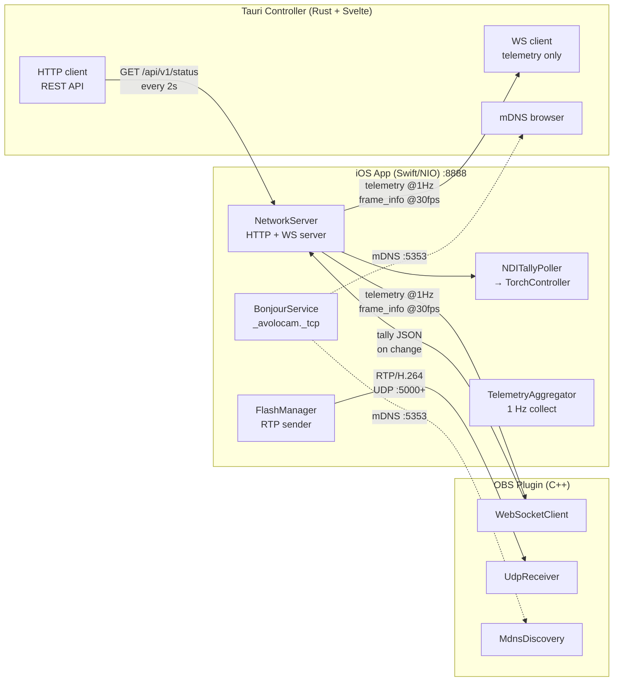
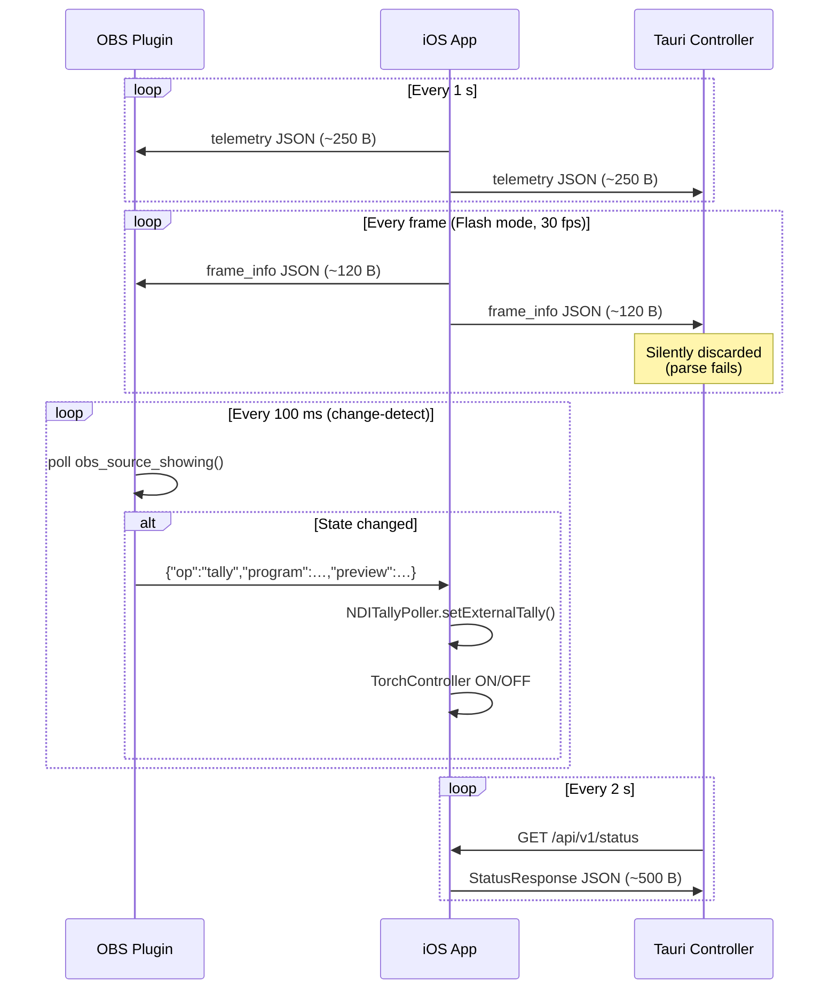
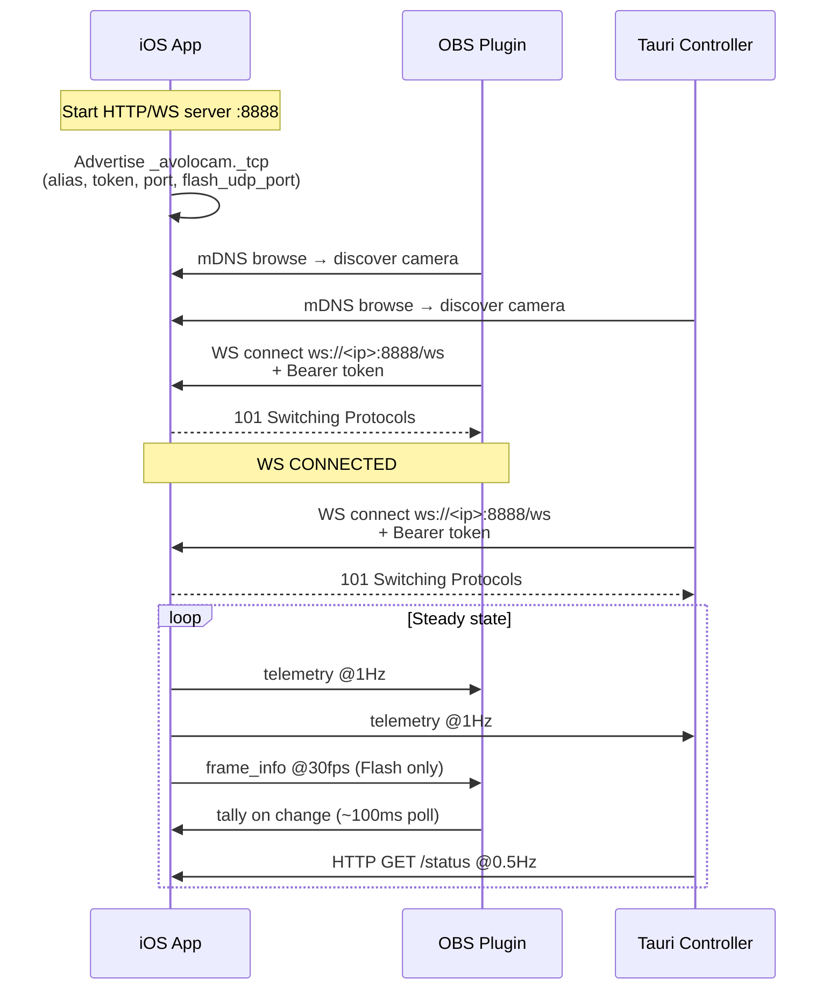
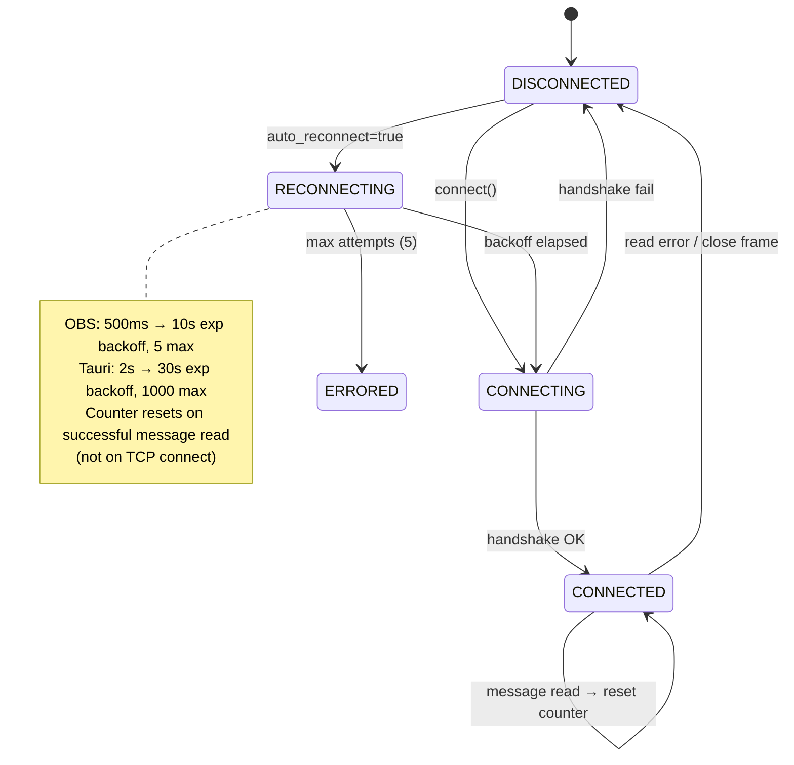
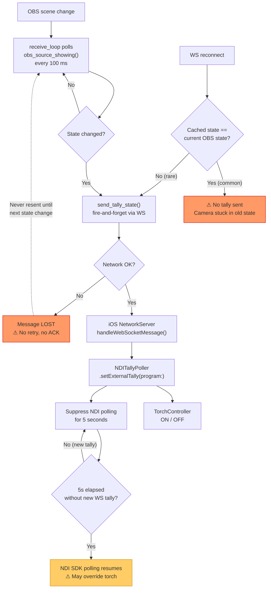
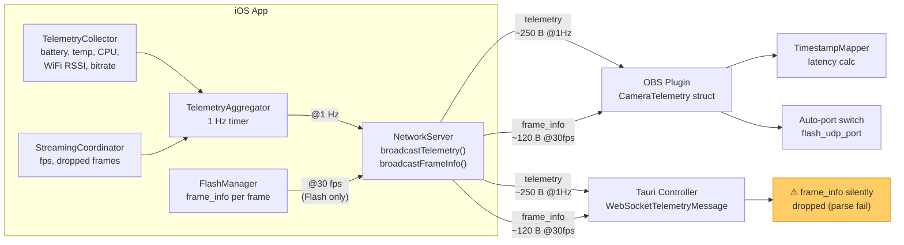

# Tally + Telemetry System Audit

**Date:** 2026-02-14
**Scope:** iOS app, OBS C++ plugin, Tauri controller
**Branch:** `fix/obs-plugin-memory-management`

---

## A) Architecture & Data Flows

### System Diagram



### Message Flow (steady state)



### Connection Topology

| Channel | Server | Client(s) | Port | Protocol |
|---------|--------|-----------|------|----------|
| Video stream | iOS (RTP sender) | OBS plugin (UdpReceiver) | 5000+ UDP | RTP/H.264 |
| Control/Telemetry WS | iOS (NIO server) | OBS plugin + Tauri + Web UI | 8888 TCP | WebSocket |
| REST API | iOS (NIO server) | Tauri + Web UI | 8888 TCP | HTTP |
| Discovery | iOS (Bonjour publish) | OBS + Tauri (mDNS browse) | 5353 UDP | mDNS |

### Key Files

| Component | File | Purpose |
|-----------|------|---------|
| iOS WS server | `ios-app/.../Network/NetworkServer.swift` | HTTP/WS server, tally handler, telemetry broadcast |
| iOS tally | `ios-app/.../NDI/NDITallyPoller.swift` | NDI tally polling + external tally + torch control |
| iOS telemetry | `ios-app/.../Streaming/TelemetryAggregator.swift` | 1 Hz collection + broadcast |
| iOS models | `ios-app/.../Models/APIModels.swift` | Message schemas (tally, telemetry, frame_info) |
| OBS WS client | `obs-avolocam-plugin/src/websocket-client.cpp` | WS connection, reconnect, message parsing |
| OBS tally sender | `obs-avolocam-plugin/src/avolocam-source.cpp:956-985` | `send_tally_state()` |
| OBS tally poll | `obs-avolocam-plugin/src/avolocam-source.cpp:462-533` | 100 ms poll in receive_loop |
| Tauri WS client | `tauri-controller/src-tauri/src/camera_client.rs:153-314` | Telemetry-only WS consumer |
| Tauri HTTP client | `tauri-controller/src-tauri/src/camera_client.rs:44-151` | REST API calls |

---

### Runtime Sequence

#### Startup → Connect → Steady State



#### Reconnect Behavior



---

## B) Findings (ranked by impact)

### Tally Data Flow (with failure points)



### B1. Tally Reliability

#### Issue #1 — CRITICAL: Tally state lost on WebSocket reconnect

**Evidence:** `send_tally_state()` (`avolocam-source.cpp:966`) only sends on change:

```cpp
if (is_program == tally_program.load() && is_preview == tally_preview.load())
    return;
```

After WS reconnect, the atomics `tally_program` / `tally_preview` retain pre-disconnect values. If OBS state hasn't changed during the reconnect window, no tally message is sent.

**Impact:** Camera torch stays in wrong state indefinitely until the next OBS scene change.

**Frequency:** Every WS reconnect (backoff window 500 ms–10 s).

---

#### Issue #2 — HIGH: Tally is fire-and-forget with no ACK or retry

**Evidence:** `ws_client->send_command(json)` → `send_text()` → `send_frame()` (`websocket-client.cpp:497-543`). The `send()` syscall return value is checked (line 537), but on failure the message is silently dropped. No retry logic exists.

**Impact:** Tally can be lost during network congestion or momentary socket issues. Combined with Issue #1 (change-only sending), a single lost message is **never resent** until the next state transition.

---

#### Issue #3 — MEDIUM: 100 ms tally polling latency

**Evidence:** Tally polling runs in `receive_loop()` at 100 ms intervals (`avolocam-source.cpp:462-464`):

```cpp
constexpr uint64_t TALLY_POLL_INTERVAL_NS = 100 * 1000 * 1000;
```

Worst-case tally detection is 100 ms after an OBS scene change. The polling is also gated by UDP receive timeout (5 ms flash / 100 ms stable), adding jitter.

**Impact:** Slight visible delay in torch response. Acceptable for most workflows.

---

#### Issue #4 — MEDIUM: Dual tally source race (NDI polling vs WebSocket)

**Evidence:** `NDITallyPoller.swift` has two tally paths:
- NDI SDK polling at 20 Hz (line 93: `ndiManager.getTallyState()`)
- External WebSocket tally with 5 s suppression timeout (line 31: `externalTallyTimeout = 5_000_000_000`)

After a WS tally message, NDI polling is suppressed for 5 s. If no further WS tally arrives within that window, NDI polling resumes and can override the torch state with stale/different data.

**Impact:** In Flash mode (where NDI tally is not valid), if the camera stays on-program for >5 s without any scene transitions, NDI polling takes over and could reset torch incorrectly.

---

#### Issue #5 — LOW: `setExternalTally` drops the `preview` parameter

**Evidence:** The OBS plugin sends both `program` and `preview` in the tally message (`avolocam-source.cpp:974`). The iOS handler decodes both (`NetworkServer.swift:844-847`). But `NDITallyPoller.setExternalTally(program:)` only accepts `program` (`NDITallyPoller.swift:137`). The `preview` value from OBS is effectively dropped at the API boundary.

**Impact:** Preview tally indicator never works via the WebSocket path. Only NDI polling can set preview state.

---

#### Issue #6 — LOW: Tauri controller has no tally participation

**Evidence:** Grep for "tally" in `tauri-controller/` returns only UI labels for torch brightness settings. The WS client splits `(write, read)` but discards the write half (`camera_client.rs:282`). No tally messages are sent or received.

**Impact:** If OBS plugin is not running (Tauri-only workflow), there is zero tally functionality.

---

### Telemetry Data Flow



### B2. Telemetry Network Pressure

#### Issue #7 — HIGH: Frame info broadcast at video frame rate to all clients

**Evidence:** In Flash mode, `broadcastFrameInfo()` is called per-frame via `flashManager.setFrameInfoCallback` (`AppCoordinator.swift:363-364`). Each message is ~120 bytes JSON. At 30 fps with 2 WS clients (OBS + Tauri):

- 60 msgs/s = ~7.2 KB/s per camera (payload only)
- ~11.5 KB/s with TCP/WS framing overhead

Tauri silently discards these messages (parsing as `WebSocketTelemetryMessage` fails, logged as warning — `camera_client.rs:293-294`).

**Impact:** Unnecessary bandwidth and CPU on iOS side. With 6 cameras and 3 clients, that's ~207 KB/s of frame_info alone.

---

#### Issue #8 — MEDIUM: Telemetry JSON is verbose and uncompressed

**Evidence:** `WebSocketTelemetryMessage` encodes ~12 fields as JSON text (`NetworkServer.swift:191-203`). Typical payload: ~250 bytes. Binary encoding (MessagePack/CBOR) would reduce to ~100 bytes.

**Impact:** Minor. At 1 Hz per camera, JSON verbosity is negligible compared to video bandwidth.

---

#### Issue #9 — LOW: No backpressure on WS broadcast

**Evidence:** `channel.writeAndFlush(frame, promise: nil)` (`NetworkServer.swift:608`) queues data with no promise/callback. NIO buffers internally, but if a slow client can't keep up, the channel buffer grows unbounded.

**Impact:** Unlikely at 1 Hz telemetry. Real risk with 30 Hz frame_info in Flash mode to a slow client (e.g., Web UI on constrained device).

---

## C) Recommendations

### C1. Minimal Changes (low-risk, high-impact)

#### Fix #1: Send tally snapshot on WS connect/reconnect

In `avolocam-source.cpp`, add a connection callback that forces a tally send:

```cpp
ws_client->set_connection_callback([this](WSState state) {
    if (state == WSState::CONNECTED) {
        // Invalidate cache to force a send
        tally_program.store(!obs_source_showing(source));
        tally_preview.store(true);
        send_tally_state();
    }
});
```

**Effort:** ~5 lines. **Fixes:** Issue #1 completely.

---

#### Fix #2: Add periodic tally heartbeat (every 2-5 s)

In `receive_loop()`, add a force-send alongside the change-detection poll:

```cpp
constexpr uint64_t TALLY_HEARTBEAT_NS = 2000ULL * 1000 * 1000; // 2 s
uint64_t last_tally_heartbeat = os_gettime_ns();

// Inside the while(running) loop:
if (now - last_tally_heartbeat >= TALLY_HEARTBEAT_NS) {
    char json[128];
    snprintf(json, sizeof(json),
             R"({"op":"tally","program":%s,"preview":%s})",
             tally_program.load() ? "true" : "false",
             tally_preview.load() ? "true" : "false");
    ws_client->send_command(json);
    last_tally_heartbeat = now;
}
```

**Effort:** ~10 lines. **Cost:** 1 extra ~60 byte message every 2 s.
**Fixes:** Issue #2 (ensures recovery from any dropped message within 2 s).

---

#### Fix #3: Pass `preview` through to `setExternalTally`

In `NDITallyPoller.swift`, change the signature:

```swift
func setExternalTally(program: Bool, preview: Bool) async {
    lastExternalTallyTime = DispatchTime.now().uptimeNanoseconds
    currentTallyState = (program: program, preview: preview)
    if program != lastProgram {
        lastProgram = program
        await torchController.set(programOn: program)
    }
    lastPreview = preview
}
```

Update the call site in `NetworkServer.swift:handleTallyUpdate` / `AppCoordinator` to pass both values.

**Effort:** ~5 lines. **Fixes:** Issue #5.

---

#### Fix #4: Stop broadcasting `frame_info` to non-OBS clients

**Option A (subscribe model):** OBS plugin sends `{"op":"subscribe","channels":["frame_info"]}` on connect. iOS only broadcasts frame_info to subscribed clients.

**Option B (quick filter):** Tag WS clients by type on connect. Only broadcast frame_info to clients that have sent at least one `{"op":"..."}` message (OBS plugin does; Tauri does not).

**Effort:** ~20 lines. **Fixes:** Issue #7.

---

### C2. Medium Changes

#### Fix #5: Add sequence number + timestamp to tally messages

```json
{"op":"tally","program":true,"preview":false,"seq":42,"ts_ms":1707900000000}
```

iOS can detect gaps, log delivery failures, and request retransmission.

**Effort:** ~15 lines across OBS plugin + iOS. Enables monitoring without changing behavior.

---

#### Fix #6: Split WebSocket into control vs telemetry channels

- `/ws/control` — tally, IDR requests, camera commands (low rate, reliable delivery matters)
- `/ws/telemetry` — 1 Hz telemetry + frame_info (high rate, lossy OK)

**Benefit:** Tally messages can't be delayed behind frame_info bursts. Independent backpressure.
**Effort:** Medium — new NIO endpoint, OBS plugin opens two connections.

---

### C3. Larger Refactors (optional)

| Refactor | Benefit | Cost | Tradeoff |
|----------|---------|------|----------|
| Binary telemetry (MessagePack/CBOR) | ~60% bandwidth reduction | New dependency, harder debugging | Low risk, moderate effort |
| Delta telemetry (only changed fields) | ~80% reduction at steady-state | State sync complexity | Medium risk |
| QUIC/UDP for telemetry | Eliminates TCP head-of-line blocking | Major rewrite, NAT issues | High risk, questionable ROI |
| gRPC/Connect for control | Strong typing, streaming, retries | Heavy dependency | High cost for this use case |

---

## D) Metrics

### Per-Camera Bandwidth (1 OBS + 1 Tauri client)

| Channel | Direction | msg/s | Avg payload (B) | kbps (payload) | kbps (w/ overhead) |
|---------|-----------|-------|------------------|----------------|---------------------|
| Telemetry (1 Hz) | iOS → each client | 1 | ~250 | 2.0 | ~3.2 |
| Frame info (Flash 30fps) | iOS → each client | 30 | ~120 | 28.8 | ~46.0 |
| Tally (change-only) | OBS → iOS | ~0.1 avg | ~60 | 0.05 | ~0.1 |
| Tally heartbeat (proposed) | OBS → iOS | 0.5 | ~60 | 0.24 | ~0.4 |
| IDR request | OBS → iOS | ~0.01 | ~25 | <0.01 | <0.01 |
| HTTP status poll | Tauri → iOS | 0.5 | ~500 | 2.0 | ~4.0 |

### Per-Camera Total (Flash mode, 2 clients)

| Metric | Value |
|--------|-------|
| WS messages/s (iOS outbound) | 62 (2x30 frame_info + 2x1 telemetry) |
| WS payload outbound (kbps) | ~61.6 |
| WS + TCP overhead (kbps) | ~98 |
| WS messages/s (iOS inbound) | ~0.2 (tally + IDR) |
| HTTP requests/s (from Tauri) | 0.5 |

### N-Camera Scaling (Flash mode)

| N cameras | Total WS out (kbps) | WiFi load (kbps) | Risk level |
|-----------|---------------------|-------------------|------------|
| 1 | ~98 | ~98 | Negligible |
| 3 | ~294 | ~294 | Low |
| 6 | ~588 | ~588 | Low-Medium |
| 8 | ~784 | ~784 | Medium |

> **Note:** Video RTP streams (8-12 Mbps/camera) dominate WiFi load by 10-100x. Telemetry is <1% of total bandwidth.

### Worst-Case Scenarios

| Scenario | Impact |
|----------|--------|
| WS reconnect during scene change | Tally stuck in wrong state until next scene change (Issue #1) |
| 6 cameras, Flash mode, 3 clients | 558 WS msgs/s total, ~1.8 Mbps control channel |
| Burst scene switching | 100 ms polling misses transient states; 10 tally msgs/s burst |
| iOS thermal throttling | Telemetry keeps sending at 1 Hz with stale data; frame_info rate drops with fps |
| 3 clients (OBS + Tauri + Web UI) | Frame info tripled to 90 msg/s per camera; backpressure risk on slow web client |

---

## E) Measurement & Instrumentation

### Capture WS traffic (macOS)

```bash
# All traffic to a specific camera
tcpdump -i en0 host <CAMERA_IP> and port 8888 -w capture.pcap

# Live message rate
tcpdump -i en0 host <CAMERA_IP> and port 8888 -l | pv -l -i 1 > /dev/null
```

### Wireshark filter

```
tcp.port == 8888 && websocket
```

### OBS plugin built-in counters

The `WebSocketClient` class already tracks atomics (`websocket-client.h`):
- `messages_received_`
- `messages_sent_`
- `reconnect_attempts_`

Expose these via OBS log or source properties panel for live monitoring.

### iOS-side counters (proposed)

Add to `NetworkServer.swift`:
```swift
private var telemetryBroadcastCount: Int = 0
private var frameInfoBroadcastCount: Int = 0
// Log every 60 s with per-second rates
```

---

## F) Priority Implementation Order

```mermaid
gantt
    title Fix Implementation Priority
    dateFormat X
    axisFormat %s

    section Critical (tally correctness)
    Fix 1 – Tally snapshot on reconnect   :done, f1, 0, 1
    Fix 2 – Tally heartbeat every 2s      :done, f2, 1, 2

    section High (bandwidth)
    Fix 4 – Filter frame_info by client   :active, f4, 2, 3

    section Medium (completeness)
    Fix 3 – Pass preview to setExternalTally :f3, 3, 4
    Fix 5 – Sequence numbers on tally        :f5, 4, 5

    section Low (only if needed)
    Fix 6 – Split WS control/telemetry       :f6, 5, 6
```



| Priority | Fix | Effort | Fixes Issues | Impact |
|----------|-----|--------|--------------|--------|
| 1 | Tally snapshot on reconnect | ~5 lines | #1 | Eliminates #1 cause of "tally doesn't work" |
| 2 | Tally heartbeat (2 s) | ~10 lines | #2, #4 | Self-healing within 2 s of any failure |
| 3 | Filter frame_info by client | ~20 lines | #7 | Reduces unnecessary bandwidth |
| 4 | Pass preview to setExternalTally | ~5 lines | #5 | Completes preview tally support |
| 5 | Sequence numbers on tally | ~15 lines | (monitoring) | Enables gap detection and diagnostics |
| 6 | Split WS channels | Medium | #9 | Only if contention becomes measurable |
