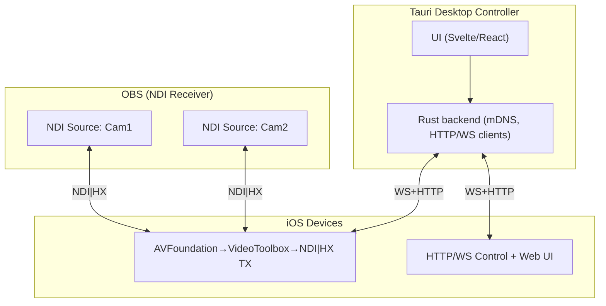

# NDI iOS Camera — Delivery Plan

## Goal

Ship an **MCP**: multi-iPhone **NDI|HX** to OBS + **remote control** from a **Tauri** desktop app. Low latency, stable, simple.

## Architecture (mermaid)



---

## Lot A — **MCP Core (Highest Priority)**

**Objective:** One app build, many phones; control from one Tauri page; stream to OBS.

**iOS app**

- Capture: `AVCaptureSession` 1080p/30; enumerate `AVCaptureDeviceFormat`.
- Encode: VideoToolbox **H.264** CBR; **GOP=fps**, **B-frames=0**.
- NDI: single TX named `AVOLO-CAM-<alias>`; mDNS advertise `_avolocam._tcp.local`.
- Control API:

  - `GET /api/v1/status` (params + telemetry + supported formats)
  - `GET /api/v1/capabilities` (res/fps/codec list)
  - `POST /api/v1/stream/start|stop`
  - `POST /api/v1/camera` (WB/ISO/shutter/focus/zoom/exposure, **wb_mode/manual lock**)

- WebSocket: `ws://<ip>:8888/ws` → telemetry 1 Hz (`fps, bitrate, ndi_state, battery, temp`).
- Web UI (on phone): minimal page (Start/Stop, WB lock, ISO/shutter, **Resolution/FPS dropdown** from `/capabilities`).
- Color/levels: **Rec.709 Full** end-to-end.

**Tauri controller**

- Discovery: **mDNS browse**, manual add (IP:port).
- Grid view: list cams (alias, FPS/bitrate/temp/battery), **Start/Stop**, **Resolution/FPS selector**, WB lock, ISO/shutter.
- Group control: fan-out same command to selected cams.
- Persist: per-cam alias + token + last profile (local JSON).

**OBS**

- Standard **NDI Source** (no custom plugin).
- Project settings: **Rec.709 / Full**.

**Security**

- Bearer token required on HTTP/WS; stored locally in controller.

**Acceptance (MCP)**

- ≥ **3 iPhones** streaming **1080p30 @ 8–12 Mb/s**, stable ≥ 2 h, drop < 1%.
- Latency glass-to-glass ≤ **150 ms** median.
- Resolution switch applies < **3 s**.
- Group WB/ISO change applies < **250 ms** to all targets.

---

## Lot B — **Stability & Multi-Cam Hardening**

- Reconnect logic: keep-alive + fast resume (<2 s after Wi-Fi blip).
- Thermal guard: warn ≥43 °C; optional auto step-down bitrate.
- Network hints UI: RSSI in telemetry; warning if bitrate/resolution mismatch.
- Error model: uniform JSON errors; controller per-cam error toasts.
- Profiles: **save/recall** per cam; **copy settings to selected cams**.
- Controller: per-cam **rename**; tag/group; read-only mode.

**Acceptance**

- 4–6 cams stable ≥ 2 h; reconnect < 2 s; error surfaces in UI; profile recall consistent.

---

## Lot C — **Image Quality & Ops**

- Orientation lock; lens selection (ultra-wide/wide/tele); zoom limits per lens.
- Anti-banding 50/60 Hz; WB presets (3200/4300/5600 K) + grey-card picker.
- **IDR on demand** (clean cut); optional **B-frames=1** toggle.
- Test patterns: SMPTE bars + focus chart; 1 kHz tone (video-only path stays silent).
- On-device preview refinement (low-fps snapshots in Web UI).

**Acceptance**

- Color match guide yields ΔE < 3 vs chart; IDR command lands within one GOP.

---

## Lot D — **Diagnostics & Admin**

- Diagnostics: `GET /api/v1/diag` (dropped frames, queue depth, temp timeline).
- Rotating logs; `GET /api/v1/logs.zip`.
- Telemetry charts in controller (sparklines fps/bitrate/temp).
- Config backup/restore from controller (all cams JSON snapshot).
- Discovery controls: mDNS on/off; **stealth** mode (API only).

**Acceptance**

- Logs downloadable; charts live update; full fleet snapshot/restore works.

---

## Lot E — **Polish & Extensions (Optional)**

- Adaptive bitrate ladder (10→8→6 Mb/s) with WS warn.
- NTP time-stamping in telemetry; tally return (basic).
- TLS (self-signed) optional; controller allow-list.
- Ethernet (USB-C→RJ45) guidance + detection.
- LUT pipeline / HDR→SDR (doc first, impl later).

---

## Data Contracts (concise)

**`GET /api/v1/status`**

```json
{
  "alias": "AVOLO-CAM-01",
  "ndi_state": "streaming|idle",
  "current": {
    "resolution": "1920x1080",
    "fps": 30,
    "bitrate": 10000000,
    "codec": "h264",
    "wb_mode": "manual",
    "wb_kelvin": 5000,
    "iso": 160,
    "shutter_s": 0.01,
    "focus_mode": "manual",
    "zoom_factor": 1.0
  },
  "telemetry": {
    "fps": 29.97,
    "bitrate": 9800000,
    "battery": 0.82,
    "temp_c": 38.4,
    "wifi_rssi": -55
  },
  "capabilities": [
    { "resolution": "1920x1080", "fps": [30, 60], "codec": ["h264", "hevc"] }
  ]
}
```

**`POST /api/v1/stream/start`**

```json
{
  "resolution": "1920x1080",
  "framerate": 30,
  "bitrate": 10000000,
  "codec": "h264"
}
```

**WebSocket Telemetry (server→client, 1 Hz)**

```json
{
  "fps": 29.97,
  "bitrate": 9800000,
  "queue_ms": 6,
  "battery": 0.78,
  "temp_c": 38.4,
  "wifi_rssi": -55,
  "ndi_state": "streaming"
}
```

**Command (client→server)**

```json
{
  "op": "set",
  "camera": {
    "wb_mode": "manual",
    "wb_kelvin": 5000,
    "iso": 160,
    "shutter_s": 0.01
  }
}
```

---

## Tech Stack Summary

- **iOS**: Swift, AVFoundation, VideoToolbox, NDI|HX SDK, SwiftNIO (HTTP/WS), Bonjour.
- **Controller (desktop)**: **Tauri** (Rust), Svelte/React, Rust mDNS + HTTP/WS clients.
- **OBS**: NDI Source; project Rec.709/Full; no custom plugin.

---

## Notes

- Internal use (no NDI branding/redistribution).
- Start with **Lot A** as MCP; **Lots B/C** solidify multi-cam quality; **D/E** add ops polish.
